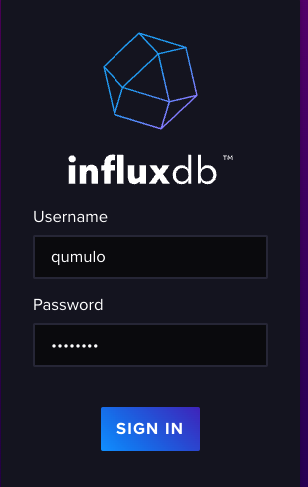
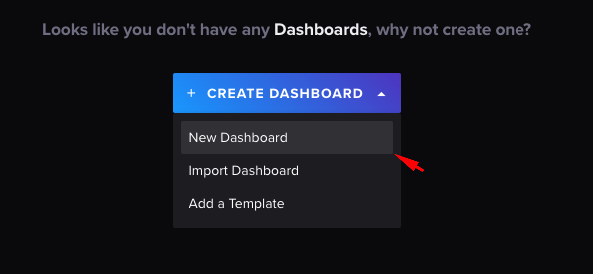
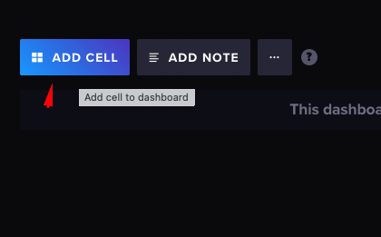
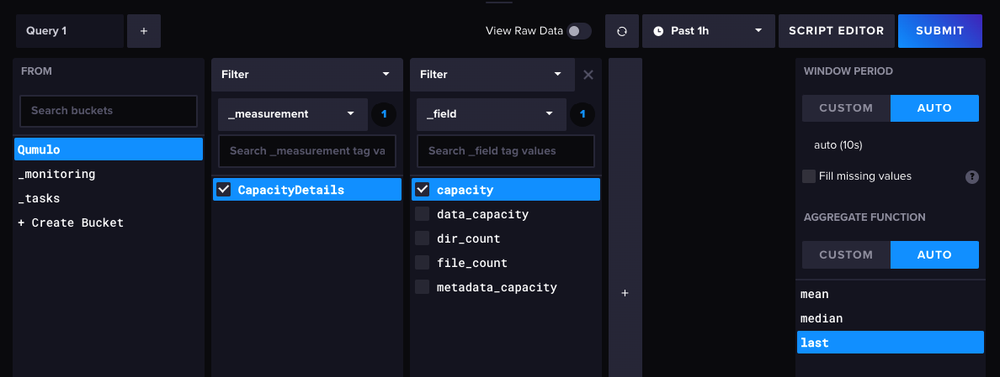
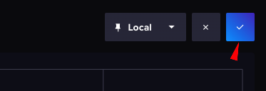

# DirectoryTrends
Qumulo Directory Capacity Trends

In this tutorial, we will show you how to install InfluxDB on Ubuntu 22.04 LTS. 

### Prerequisites
* Ubuntu 22.04
* It’s recommended that you use a fresh OS install to prevent any potential issues.
* SSH access to the server.

### Install InfluxDB on Ubuntu 22.04

__Step 1.__ First, make sure that all your system packages are up-to-date by running the following apt commands in the terminal.

```
sudo apt update
sudo apt upgrade
sudo apt install wget apt-transport-https gnupg2 software-properties-common
```
__Step 2.__ Installing InfluxDB on Ubuntu 22.04.

By default, InfluxDB is not available on Ubuntu 22.04 base repository. Now install the add InfluxDB PPA repository to your system using the following command:

```
echo 'deb [signed-by=/etc/apt/trusted.gpg.d/influxdb.gpg] https://repos.influxdata.com/debian stable main' | sudo tee /etc/apt/sources.list.d/influxdata.list
```
Next, import the GPG key:
```
wget -q https://repos.influxdata.com/influxdb.key
echo '23a1c8836f0afc5ed24e0486339d7cc8f6790b83886c4c96995b88a061c5bb5d influxdb.key' | sha256sum -c && cat influxdb.key | gpg --dearmor | sudo tee /etc/apt/trusted.gpg.d/influxdb.gpg > /dev/null
```

After the repository has been added successfully, you can then proceed to install InfluxDB on Ubuntu using the command shown in the output below:

```
sudo apt update
sudo apt install influxdb2
```

Once successfully installed, Start and enable the service to start on bootup:

```
sudo systemctl enable --now influxdb
sudo systemctl start influxdb
```
__Step 3.__ Configure InfluxDB Database and User Credentials.
Now run the following command to perform the initial configuration for Influx:
```
influx setup
```
Output:
```
> Welcome to InfluxDB 2.0!
? Please type your primary username qumulo
? Please type your password ************
? Please type your password again ************
? Please type your primary organization name Qumulo
? Please type your primary bucket name Qumulo
? Please type your retention period in hours, or 0 for infinite 2160
? Setup with these parameters?
  Username:          qumulo
  Organization:      Qumulo
  Bucket:            Qumulo
  Retention Period:  2160h0m0s
 Yes
User    Organization    Bucket
qumulo  Qumulo          Qumulo
```
Your details are stored in the __/home/username/.influxdbv2/configs__ file.

__Step 4.__ Configure Firewall.

Now we set up an Uncomplicated Firewall (UFW) with InfluxDB to allow public access on default web ports __8086__:
```
sudo ufw allow 8086/tcp
sudo ufw enable
```
__Step 5.__ Accessing InfluxDB Web Interface.

Once successfully installed, now open a web browser and go to __http://your-IP-address:8086__ 

__Step 6.__ Checking InfluxDB Token details.
Your details are stored in the __/home/username/.influxdbv2/configs__ file. Open this file to learn your default user Token.
```
cat /home/username/.influxdbv2/configs
[default]
  url = "http://localhost:8086"
  token = "5CdgSRfAwm3Mt37yuO_P5Pf1Y7hFLdaPlMU8o4sP2BD........=="
  org = "Qumulo"
  active = true
```
### Preparing of the Python scripts

__Step 1.__ First, before you can run the Python scripts, you will need to clone this repository on your machine. For that, you will need to have `git` installed on your machine.
```
apt install git
```

__Step 2.__ Create `qumulo` directory under `/opt` directory. Move that `/opt/qumulo` directory. Download the repository inside this directory. 
```
mkdir /opt/qumulo
cd /opt/qumulo
git clone https://github.com/BeratUlualan/DirectoryTrends.git
```

__Step 3.__ Install the required Python libraries. You will need Internet access from the machine for this step.
```
apt install python3-pip
pip3 install -r requirements.txt
```

__Step 4.__ Edit the configuration file according the configurations of your Qumulo cluster and InfluxDB environment.
```
nano config/config.json 
```

```
{
        "cluster" : {
                "address" : "CLUSTER_ADDRESS",
        "port" : "8000",
                "username" : "",
                "password" : "",
        "access_token": "QUMULO_ACCESS_TOKEN"
        },
    "influxdb" : {
        "address" : "INFLUXDB_ADRESS",
        "token" : "INFLUXDB_TOKEN",
        "bucket_name" : "BUCKET_NAME"
    },
    "email":{
        "from": "from@mail.com",
        "to": "to@mail.com",
        "login": "",
        "password": "",
        "server": "SMTP_SERVER_ADDRESS",
        "port": 25,
        "use": "none"
    },
    "directories": {
        "dir_paths": ["/Dir1","/Dir2"],
        "max_depth": 0
    }
}
```

__access_token__ : [Check Qumulo Access Token Details] (https://docs.qumulo.com/administrator-guide/external-services/using-access-tokens.html)

__token__ : [Check InfluxDB Token Details] (https://docs.influxdata.com/influxdb/cloud/security/tokens/create-token/)

__bucket_name__ : InfluxDB bucket name

Email options:
* __from__ - From email address
* __to__ - An email address of an individual or group
* __login__ - Username needed to login to the email server
* __password__ - Password needed to login to the email server
* __server__ - FQDN or IP address of the email server
* __port__ - TCP port needed to communicate with the email server
* __use__ - none, ssl or tls

__dir_paths__ : The Qumulo file system paths of the directories that you want to monitor

__max_depth__ : If you want to monitor sub-directories of the defined directories in __dir_paths__ option, set it __1__. Otherwise, you can set __0__.

__Step 5.__ Test your scripts.
####Influx DB Push
```
python3 InfluxDBPush.py --config-file config/config.json 
```
Outputs:
```
2023-05-31 11:38:43,606 | DirectoryTrends | INFO | DirectoryTrends - 6.1.0
2023-05-31 11:38:43,745 | DirectoryTrends | INFO | Connection established with groot.eng.qumulo.com
2023-05-31 11:38:43,746 | DirectoryTrends | INFO | Capacity details are being collected
```

###Email Push
```
python3 EmailPush.py --config-file config/config.json 
```
Outputs:
```
2023-05-31 11:42:43,008 | DirectoryTrends | INFO | DirectoryTrends - 6.1.0
2023-05-31 11:42:43,169 | DirectoryTrends | INFO | Connection established with groot.eng.qumulo.com
2023-05-31 11:42:43,191 | DirectoryTrends | INFO | SMTP connection is established 
````

### Crontab Settings
#### Understand Cron Job Syntax
Every Cron task is written in a Cron expression that consists of two parts: the time schedule and the command to be executed. While the command can be virtually any command that you would normally execute in your command-line environment, writing a proper time schedule requires some practice.

The Cron task syntax consists of 6 arguments separated by spaces. First 5 arguments describe the execution time, while the last argument is a command or a full path to a shell script that is going to be executed by the default shell:

[minute] [hour] [day of month] [month] [day of week] [command]

Commands are executed by Cron when the minute, hour and month fields match the current time, and when at least one of the day fields – either day of month, or day of week – match the current time. The allowed values are these:

__Field	Allowed values__
* __minute__	0-59
* __hour__	0-23
* __day__ of month	1-31
* __month__	1-12 (or names: JAN - DEC)
* __day of week__	0-6 (or names: SUN - SAT)

There are also some special characters that you can use to further specify the execution time:

* __Asterisk__	An asterisk represents every allowed value (first to last).	* (run every hour, month, etc.)
* __Range__	A range consists of two numbers separated by a hyphen.	0-5 (run from 0th to 5th hour, month, etc.)
* __List__	A list is a set of numbers or ranges separated by commas.	0,1,2,3,4,5 (run from 0th to 5th hour, month, etc.)
* __Step__	A step is used in conjunction with ranges or asterisks.	*/2 (run every second hour, month, etc.)
* __Name__	A name can be used with month or day of week fields. Names are case insensitive.	Jan, Feb, Mar (run every January, February, and March)
* __Special__ string	A special string can be used instead of the first five arguments.	@reboot, @weekly (run every time at startup, and once a week)

You may play with execution time targeting rules by using the crontab.guru website which is a great place to deepen your understanding and double check whether you defined the execution time right.

__Step 1.__ Installing cron
Most often Cron is installed to your Ubuntu machine by default. In case it is not there, you may install it yourself.

Update your system’s local package list:
```
sudo apt update
```
And install the newest version of cron. The following command also updates Cron to the latest version, if you already have it installed:
```
sudo apt install cron
```
__Step 2.__ Setting Cron Jobs for Directory Trends.
```
sudo vim /etc/crontab
```
Add the below lines
```
00 01 * * * root cd /opt/qumulo/Directory/Trends; /usr/bin/python3 InfluxDBPush.py --config-file config/config.json 
00 01 * * * root cd /opt/qumulo/Directory/Trends; /usr/bin/python3 EmailPush.py --config-file config/config.json 
```

You can change time and period according your needs.

### Create a InfluxDB Dashboard
__Step 1.__ Open a browser and go to __http://your-IP-address:8086__ 

__Step 2.__ Login with user that you defined previously.



__Step 2.__ Create a new dashboard
In the navigation menu on the left, select __Dashboards__.


Click the  Create Dashboard menu in the upper right and select New Dashboard.



Enter a name for your dashboard in the Name this dashboard field in the upper left.

__Step 3.__ Add Cell
From your dashboard, click  Add Cell.



__Step 4.__ Create a query
Create a query in the Data Explorer following the instructions in Explore metrics.



Enter a name for your cell in the upper left.

Click the __checkmark icon__ to save the cell to your dashboard.



## Help

To post feedback, submit feature ideas, or report bugs, use the [Issues](https://github.com/BeratUlualan/DirectoryTrends/issues) section of this GitHub repo.

## License

[](https://opensource.org/licenses/MIT)

See [LICENSE](LICENSE) for full details

    MIT License
    
    Copyright (c) 2022 Qumulo, Inc.
    
    Permission is hereby granted, free of charge, to any person obtaining a copy
    of this software and associated documentation files (the "Software"), to deal
    in the Software without restriction, including without limitation the rights
    to use, copy, modify, merge, publish, distribute, sublicense, and/or sell
    copies of the Software, and to permit persons to whom the Software is
    furnished to do so, subject to the following conditions:
    
    The above copyright notice and this permission notice shall be included in all
    copies or substantial portions of the Software.
    
    THE SOFTWARE IS PROVIDED "AS IS", WITHOUT WARRANTY OF ANY KIND, EXPRESS OR
    IMPLIED, INCLUDING BUT NOT LIMITED TO THE WARRANTIES OF MERCHANTABILITY,
    FITNESS FOR A PARTICULAR PURPOSE AND NONINFRINGEMENT. IN NO EVENT SHALL THE
    AUTHORS OR COPYRIGHT HOLDERS BE LIABLE FOR ANY CLAIM, DAMAGES OR OTHER
    LIABILITY, WHETHER IN AN ACTION OF CONTRACT, TORT OR OTHERWISE, ARISING FROM,
    OUT OF OR IN CONNECTION WITH THE SOFTWARE OR THE USE OR OTHER DEALINGS IN THE
    SOFTWARE.
    
## Contributors

 - [Berat Ulualan](https://github.com/beratulualan)

